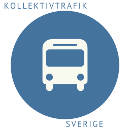

  
  <h1 align="center">Kollektivtrafik Sverige</h1>
  

    <b>Home Assistant integration for Swedish public transport realtime departures.</b> 
    Powered by the Trafiklab Realtime APIs.
  

  
  
  
  
  
  

---

## 🚍 Features

- **Realtime departures** from any Trafiklab-supported stop in Sweden.
- **Five departure sensors per stop** (next 5 departures).
- **Line filtering** (e.g., `1, 4, 42X`).
- **Direction filtering** (`0`, `1`, or empty for both).
- **Optional time windows** (e.g., `06:00-10:00, 16:00-22:00`).
- **Minimal API usage** (safe for Trafiklab quotas).
- **Modern Home Assistant config flow** — No YAML required.
- **Clean, predictable entity naming** with no arrivals or bloat.

---

## 📦 Installation

### HACS
1. Open **HACS → Integrations**.
2. Click the three dots in the top right and select **Custom Repositories**.
3. Add `https://github.com/19E71/Kollektivtrafik_Sverige` with category **Integration**.
4. Search for **Kollektivtrafik Sverige** and install.
5. **Restart** Home Assistant.

---

## 🔑 Getting Your Trafiklab API Key

1. **Create a project:** Sign up/in at [Trafiklab Project List](https://developer.trafiklab.se/project/list).
2. **Generate Key:** Inside your project, click **Create Key** and select **Trafiklab Realtime APIs**.
3. **Save:** This is the key you will enter during the Home Assistant setup.

---

## 🆔 Finding Your Stop ID

Use the official [Stop Lookup tool](https://www.trafiklab.se/api/our-apis/trafiklab-realtime-apis/stop-lookup):
1. Enter a stop name (e.g., “Sundsvall”, “Stockholm”).
2. Enter your API key and click **Try it out**.
3. Open the generated URL and copy the **`stop_group -> id`** value (e.g., `"740098000"`).

---

## ⚙️ Configuration (UI)

1. Go to **Settings → Devices & Services → Add Integration**.
2. Search for **Kollektivtrafik Sverige**.
3. Enter your **API key** and **Stop ID**.
4. Configure optional filters and **Time Windows**.

The integration creates **five sensors**:
- `sensor.kollektivtrafik_sverige_departure_1` ... to `_5`

---

## ⏱️ Sensor Behavior

**State:** Minutes until departure (integer).

**Attributes:**
- `line`, `destination`, `direction`
- `scheduled_time`, `expected_time`
- `real_time` (boolean)
- `transport_mode`, `deviations`

---

## 🏗️ Architecture Overview
This integration is built for robustness and minimal API usage:
1. **Polling Engine:** Prevents overlapping requests.
2. **Request Queue:** Protects your Trafiklab quota.
3. **Coordinator:** Shares one API call across all five sensors.
4. **Filters:** Efficiently processes lines, directions, and time windows.

### 📉 API Quota Considerations
- One API call per update interval.
- Time windows reduce unnecessary polling during off-hours.
- **Recommended interval:** 300 seconds (5 minutes).

---

## 🛠️ Troubleshooting

- **"Invalid API key":** Ensure it is specifically for the *Trafiklab Realtime API*.
- **"Invalid stop ID":** Ensure you used the *stop_group ID*, not a child/platform ID.
- **No departures shown:** Check your filters or verify the stop on the Trafiklab status page.
- **Status "Unavailable":** Likely a quota limit or temporary network issue; it will recover automatically.

---

## 📄 License
This project is licensed under the **Mozilla Public License 2.0 (MPL‑2.0)**. 
See the `LICENSE` file for details.